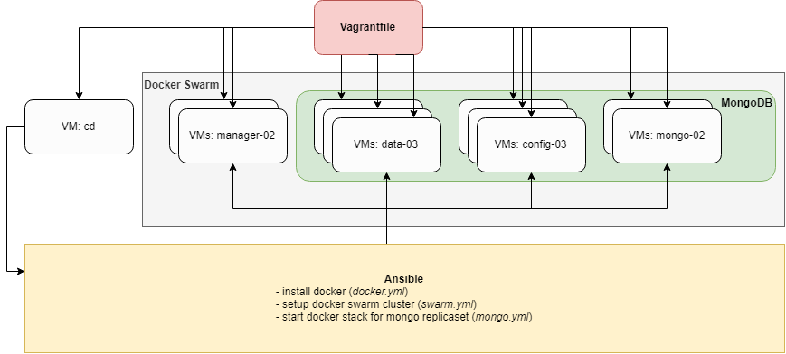
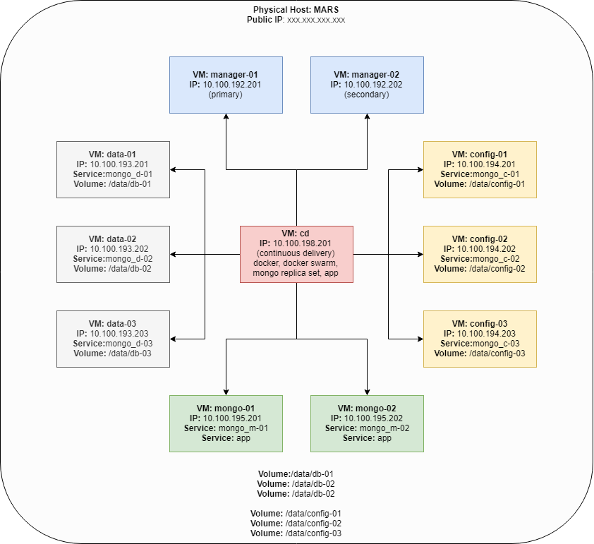

# Intro
Using this repo, you can automate the creation process of MongoDB ReplicaSets (optionally with Sharding Enabled) deployed inside a Docker Swarm using Vagrant (VirtualBox) and Ansible, bootstrapping the following High-Availablity architecture of VMs ready for production use:

- **cd**: Continous Delivery VM via which software is installed on the other VMs (Docker, Docker Swarm, Mongo, App etc)
- **manager-01, manager-02**: 2x VMs for Docker Managers (manager-01 being the primary)
- **data-01, data-02, data-03**: 3x VMs for storing data in the Mongo Data Instances (Replica Sets/Shards)
- **config-01, config-02, config-03**: 3x VMs for Mongo Config Instances
- **mongo-01, mongo-02**: 2x VMs for Mongo Instances (Router instances)

# Networks
- VM private network: 10.100.198.200, 10.100.193.20[1-2], 10.100.194.20[1-3], 10.100.194.20[1-3], 10.100.195.20[1-2]
- Docker Overlay Network:
  - **mongo**: subnet 11.0.0.0/24 - mongo cluster internal communication (data, config, mongos)
  - **mongos**: subnet 12.0.0.0/24 - mongo cluster external communication (app, mongos)
  
# Volumes
- `/data/db-01` - data-01 Volume
- `/data/db-02` - data-02 Volume
- `/data/db-03` - data-03 Volume

- `/data/config-01` - config-01 Volume
- `/data/config-02` - config-02 Volume
- `/data/config-03` - config-03 Volume

# VMs
- **cd**: Continous Delivery VM via which software is installed on the other VMs (Docker, Docker Swarm, Mongo, App etc)
  - **IP**: 10.100.198.200, **NETMASK**: 255.255.0.0

- **manager-01**: Primary docker manager node 
  - **IP**: 10.100.192.201, **NETMASK**: 255.255.0.0
- **manager-02**: Secondary docker manager node 
  - **IP**: 10.100.192.202, **NETMASK**: 255.255.0.0

- **data-01**: First data node - **datars** replica set with shards optionally
  - **IP**: 10.100.193.201, **NETMASK**: 255.255.0.0
  - **Docker Service**: mongo_d-01
  - **Docker Volume**: /data/db-01
  - **Docker Network**: mongo, **Subnet**: 11.0.0.0/24
- **data-02**: Second data node - **datars** replica set with shards optionally
  - **IP**: 10.100.193.202, **NETMASK**: 255.255.0.0
  - **Docker Service**: mongo_d-02
  - **Docker Volume**: /data/db-02
  - **Docker Network**: mongo, **Subnet**: 11.0.0.0/24
- **data-03**: Third data node - **datars** replica set with shards optionally
  - **IP**: 10.100.193.203, **NETMASK**: 255.255.0.0
  - **Docker Service**: mongo_d-03
  - **Docker Volume**: /data/db-03
  - **Docker Network**:
    - mongo, **Subnet**: 11.0.0.0/24

- **config-01**: First config node - **configrs** replica set
  - **IP**: 10.100.194.201, **NETMASK**: 255.255.0.0
  - **Docker Service**: mongo_c-01
  - **Docker Volume**: /data/config-01
  - **Docker Network**: mongo, **Subnet**: 11.0.0.0/24
- **config-02**: Second config node - **configrs** replica set
  - **IP**: 10.100.194.202, **NETMASK**: 255.255.0.0
  - **Docker Service**: mongo_c-02
  - **Docker Volume**: /data/config-02
  - **Docker Network**: mongo, **Subnet**: 11.0.0.0/24
- **config-03**: Third config node - **configrs** replica set
  - **IP**: 10.100.194.203, **NETMASK**: 255.255.0.0
  - **Docker Service**: mongo_c-03
  - **Docker Volume**: /data/config-03
  - **Docker Network**: mongo, **Subnet**: 11.0.0.0/24

- **mongo-01**: First mongo node (Router)
  - **IP**: 10.100.195.201, **NETMASK**: 255.255.0.0
  - **Docker Service**: mongo_m-01
  - **Docker Network**: mongo, **Subnet**: 11.0.0.0/24
  - **Docker Network**: mongos, **Subnet**: 12.0.0.0/24
- **mongo-02**: Second mongo node
  - **IP**: 10.100.195.202, **NETMASK**: 255.255.0.0
  - **Docker Service**: mongo_m-02
  - **Docker Network**: mongo, **Subnet**: 11.0.0.0/24
  - **Docker Network**: mongos, **Subnet**: 12.0.0.0/24

# Pre-requisites
- VirtualBox installed
- Vagrant installed

The following ports are available on the Host where you deploy these VMs:
- port: 8091 mapped to mongo-01:8080 (mongo log API app)
- port: 8092 mapped to mongo-02:8080 (mongo log API app)
- port: 27018 mapped to mongo-01:27017
- port: 27019 mapped to mongo-02:27017

In addition, you need to create the Shared folders (between the Physical Host and your VMs) that will be used as Docker Volumes:
- `/data/db-01` - data-01 Volume
- `/data/db-02` - data-02 Volume
- `/data/db-03` - data-03 Volume

- `/data/config-01` - config-01 Volume
- `/data/config-02` - config-02 Volume
- `/data/config-03` - config-03 Volume

e.g. `mkdir db-01 db-02 db-03 config-01 config-02 config-03 & chmod 666 db-* config-*`

# Start the Cluster of VMs
`vagrant up` -> Start all VMs and install Docker on them

# Install Docker on all VMs
1. `vagrant ssh cd` -> login (ssh) to cd VM in order to bootstrap the Docker Swarm setup
2. `ansible-playbook /vagrant/ansible/docker.yml -i /vagrant/ansible/hosts/cluster`

# Initialize Docker Swarm
1. `vagrant ssh cd` -> login (ssh) to cd VM in order to bootstrap the Docker Swarm setup [skip this step if your are still logged in to cd VM]
2. `ansible-playbook /vagrant/ansible/swarm.yml -i /vagrant/ansible/hosts/cluster`

# Initialize Mongo Replicas/Shards
1. `vagrant ssh cd` -> login (ssh) to cd VM in order to bootstrap the Docker Swarm setup [skip this step if your are still logged in to cd VM]
2. `ansible-playbook /vagrant/ansible/mongo.yml -i /vagrant/ansible/hosts/cluster`

# Test Write to and Read from the Mongo Cluster
You can test the Write/Read to the Mongo Cluster, you can use the deployed Mongo Log API NodeJS app from the docker repository `gjovanov/mongo-log-api`, also available in the /app folder.

This API app is deployed in the cluster on VMs mongo-01 and mongo-02 via the same docker stack file: `/ansible/roles/mongo-swarm/docker_stack.yml`

## Write
`curl -d '{ }' -H "Content-Type: application/json" -X POST http://localhost:8091/api/log/write`

## Read
`curl http://localhost:8091/api/log/read?size=20`

## Mongos connection string in MongooseJS
```javascript
const db = mongoose.createConnection('mongodb://m-01:27017,m-02:27017/log', {
    family: 4, // this is important as it default is IPv6 and it slows down drastically (DNS lookup)
    useNewUrlParser: true
})
```